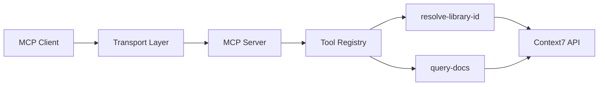

# MCP Server Overview

Context7 MCP Server is a Model Context Protocol (MCP) server that provides LLMs with up-to-date, version-specific documentation and code examples for any programming library or framework.

## What is Context7 MCP?

Context7 MCP pulls documentation straight from the source and places it directly into your LLM's context. This eliminates common issues with AI coding assistants:

- **Outdated code examples** based on year-old training data
- **Hallucinated APIs** that don't exist
- **Generic answers** for old package versions

## Architecture

Context7 MCP Server is built on the [Model Context Protocol](https://modelcontextprotocol.io) and supports two transport modes:

### Transport Modes

<CardGroup cols={2}>
  <Card title="Local (stdio)" icon="computer">
    Runs locally via `npx` using standard input/output communication.
    
    **Best for:**
    - Single-user environments
    - Maximum privacy
    - Offline compatibility (after initial install)
  </Card>
  
  <Card title="Remote (HTTP)" icon="globe">
    Connects to `https://mcp.context7.com/mcp` via HTTP transport.
    
    **Best for:**
    - Teams and organizations
    - No local installation required
    - Always up-to-date
  </Card>
</CardGroup>

### Server Components

The MCP server consists of several key components:



**Transport Layer**
- **stdio**: Standard input/output for local connections
- **HTTP**: RESTful HTTP server for remote connections

**Tool Registry**
- Registers and manages available MCP tools
- Handles tool invocations from LLM clients

**Context7 API**
- Backend service for library search and documentation retrieval
- Handles intelligent reranking and context generation

## Key Features

### Version-Specific Documentation

Specify exact library versions in your prompts:

```txt
How do I set up Next.js 14 middleware? use context7
```

Context7 automatically matches and retrieves documentation for the requested version.

### Library Resolution

The server intelligently resolves library names to Context7-compatible IDs:

- Search for libraries by name
- Rank results by relevance, reputation, and quality
- Return detailed metadata including versions, code snippets, and benchmark scores

### Smart Context Retrieval

Retrieves documentation using natural language queries:

- Intelligent reranking of documentation sections
- Focus on relevant code examples
- Include API references and configuration options

## Authentication

Context7 MCP Server supports two authentication methods:

<CardGroup cols={2}>
  <Card title="API Key" icon="key">
    Traditional API key authentication for both local and remote connections.
    
    Get your free API key at [context7.com/dashboard](https://context7.com/dashboard)
  </Card>
  
  <Card title="OAuth 2.0" icon="lock">
    OAuth 2.0 authentication for remote HTTP connections.
    
    Implements the [MCP OAuth specification](https://modelcontextprotocol.io/specification/2025-03-26/basic/authorization)
  </Card>
</CardGroup>

## Rate Limits

**Without API Key:**
- Limited requests per hour
- Suitable for testing and evaluation

**With Free API Key:**
- Higher rate limits
- Recommended for regular use

**Paid Plans:**
- Professional and enterprise rate limits
- Visit [context7.com/plans](https://context7.com/plans) for details

## Supported Libraries

Context7 supports 1000+ libraries across all major programming languages and frameworks:

- JavaScript/TypeScript (Next.js, React, Express, etc.)
- Python (Django, FastAPI, Pandas, etc.)
- Go, Rust, Java, C#, and more
- Cloud platforms (AWS, Azure, GCP, Cloudflare)
- Databases (MongoDB, PostgreSQL, Redis, etc.)

Browse the full library catalog at [context7.com/libraries](https://context7.com/libraries)

## Privacy & Security

<Warning>
  Never include sensitive information (API keys, passwords, credentials, personal data, or proprietary code) in your queries. All queries are sent to the Context7 API for processing.
</Warning>

- Queries are processed server-side for intelligent reranking
- API keys are encrypted in transit
- OAuth tokens follow industry-standard security practices
- See [Privacy Policy](https://context7.com/privacy) for details

## Next Steps

<CardGroup cols={2}>
  <Card title="Cursor Setup" icon="arrow-pointer" href="/mcp/cursor">
    Install Context7 in Cursor IDE
  </Card>
  
  <Card title="Claude Code Setup" icon="terminal" href="/mcp/claude-code">
    Install Context7 in Claude Code
  </Card>
  
  <Card title="Configuration" icon="gear" href="/mcp/configuration">
    Configure API keys and options
  </Card>
  
  <Card title="Tools Reference" icon="wrench" href="/mcp/tools-reference">
    Explore available MCP tools
  </Card>
</CardGroup>