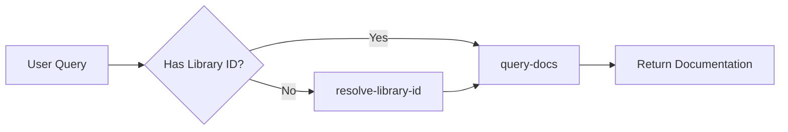

# Tools Reference

Context7 MCP Server provides two tools that LLMs can use to access up-to-date documentation and code examples.

## Overview

The workflow for using Context7 tools:



<Steps>
  <Step title="Identify Library Need">
    User asks a question that requires library documentation.
  </Step>
  
  <Step title="Resolve Library ID">
    If the library ID is unknown, use `resolve-library-id` to find it.
  </Step>
  
  <Step title="Query Documentation">
    Use `query-docs` with the library ID to retrieve relevant documentation.
  </Step>
  
  <Step title="Generate Response">
    LLM uses the documentation to generate an accurate, up-to-date response.
  </Step>
</Steps>

## resolve-library-id

Resolves a package or product name to a Context7-compatible library ID.

### When to Use

Call this tool when:
- User mentions a library by name (e.g., "Next.js", "MongoDB", "React")
- You need to find the Context7-compatible library ID
- User does **not** provide an explicit library ID in format `/org/project`

### Parameters

<ParamField path="query" type="string" required>
  The question or task you need help with. This is used to rank library results by relevance.
  
  **Example:** `"How do I set up authentication in Next.js?"`
  
  <Warning>
    Do not include sensitive information such as API keys, passwords, credentials, personal data, or proprietary code.
  </Warning>
</ParamField>

<ParamField path="libraryName" type="string" required>
  Library name to search for and retrieve a Context7-compatible library ID.
  
  **Example:** `"nextjs"`, `"mongodb"`, `"react"`
</ParamField>

### Response Format

The tool returns a list of matching libraries with detailed metadata:

```text
Available Libraries:

1. /vercel/next.js
   Name: Next.js
   Description: The React Framework for Production
   Code Snippets: 1,234
   Source Reputation: High
   Benchmark Score: 98
   Versions: 15.1.0, 15.0.0, 14.2.0, 14.1.0, 14.0.0

2. /nextauthjs/next-auth
   Name: NextAuth.js
   Description: Authentication for Next.js
   Code Snippets: 456
   Source Reputation: High
   Benchmark Score: 95
   Versions: 5.0.0, 4.24.0
```

### Response Fields

<ResponseField name="Library ID" type="string">
  Context7-compatible identifier in format `/org/project`
  
  **Example:** `/vercel/next.js`
</ResponseField>

<ResponseField name="Name" type="string">
  Human-readable library or package name
  
  **Example:** `Next.js`
</ResponseField>

<ResponseField name="Description" type="string">
  Short summary of the library's purpose
  
  **Example:** `The React Framework for Production`
</ResponseField>

<ResponseField name="Code Snippets" type="number">
  Number of available code examples in the documentation
  
  Higher values indicate more comprehensive documentation
</ResponseField>

<ResponseField name="Source Reputation" type="string">
  Authority indicator for the library's source
  
  **Values:** `High`, `Medium`, `Low`, `Unknown`
</ResponseField>

<ResponseField name="Benchmark Score" type="number">
  Quality indicator (0-100, where 100 is highest quality)
  
  Based on documentation completeness, code examples, and community engagement
</ResponseField>

<ResponseField name="Versions" type="array">
  List of available versions for this library
  
  **Example:** `15.1.0, 15.0.0, 14.2.0`
  
  Use format `/org/project/version` to query specific versions
</ResponseField>

### Selection Process

When multiple libraries match, the LLM should select based on:

1. **Name similarity** - Exact matches prioritized
2. **Description relevance** - Match to query intent
3. **Documentation coverage** - Higher Code Snippet counts preferred
4. **Source reputation** - High/Medium reputation more authoritative
5. **Benchmark score** - Higher scores indicate better quality

### Usage Example

<CodeGroup>
  ```txt User Prompt
  How do I set up authentication in Next.js?
  ```

  ```json Tool Call
  {
    "name": "resolve-library-id",
    "arguments": {
      "query": "How do I set up authentication in Next.js?",
      "libraryName": "nextjs"
    }
  }
  ```

  ```text Tool Response
  Available Libraries:

  1. /vercel/next.js
     Name: Next.js
     Description: The React Framework for Production
     Code Snippets: 1,234
     Source Reputation: High
     Benchmark Score: 98
     Versions: 15.1.0, 15.0.0, 14.2.0
  ```
</CodeGroup>

### Best Practices

<Warning>
  Do not call this tool more than 3 times per question. If you cannot find what you need after 3 calls, use the best result you have.
</Warning>

- Provide specific, descriptive queries for better relevance ranking
- Use exact library names when possible
- Check all returned options before selecting
- If ambiguous, ask user for clarification
- Clearly state your selection and reasoning

### Error Handling

If no libraries are found:

```text
No libraries found matching the provided name.
```

**Actions:**
1. Try alternative library names or spellings
2. Check for typos in `libraryName`
3. Suggest related libraries to user
4. Ask user for more specific library information

---

## query-docs

Retrieves and queries up-to-date documentation and code examples from Context7.

### When to Use

Call this tool when:
- You have a Context7-compatible library ID from `resolve-library-id`
- User provides explicit library ID (e.g., `/mongodb/docs`, `/vercel/next.js`)
- You need specific documentation for a programming task

### Prerequisites

<Warning>
  You must call `resolve-library-id` first to obtain the library ID, **unless** the user explicitly provides a library ID in the format `/org/project` or `/org/project/version`.
</Warning>

### Parameters

<ParamField path="libraryId" type="string" required>
  Exact Context7-compatible library ID retrieved from `resolve-library-id` or provided by user.
  
  **Format:** `/org/project` or `/org/project/version`
  
  **Examples:**
  - `/mongodb/docs`
  - `/vercel/next.js`
  - `/supabase/supabase`
  - `/vercel/next.js/v14.3.0-canary.87`
</ParamField>

<ParamField path="query" type="string" required>
  The question or task you need help with. Be specific and include relevant details.
  
  **Good examples:**
  - `"How to set up authentication with JWT in Express.js"`
  - `"React useEffect cleanup function examples"`
  - `"Configure MongoDB connection pooling"`
  
  **Bad examples:**
  - `"auth"` (too vague)
  - `"hooks"` (too generic)
  - `"help"` (no context)
  
  <Warning>
    Do not include sensitive information such as API keys, passwords, credentials, personal data, or proprietary code.
  </Warning>
</ParamField>

### Response Format

The tool returns intelligently ranked documentation and code examples:

```markdown
## Setting Up Authentication with JWT in Express.js

### Installation

\`\`\`bash
npm install jsonwebtoken express
\`\`\`

### Basic JWT Middleware

\`\`\`javascript
const jwt = require('jsonwebtoken');
const express = require('express');

const authenticateToken = (req, res, next) => {
  const authHeader = req.headers['authorization'];
  const token = authHeader && authHeader.split(' ')[1];

  if (!token) return res.sendStatus(401);

  jwt.verify(token, process.env.ACCESS_TOKEN_SECRET, (err, user) => {
    if (err) return res.sendStatus(403);
    req.user = user;
    next();
  });
};

app.use(authenticateToken);
\`\`\`

### Generating Tokens

\`\`\`javascript
const token = jwt.sign(
  { userId: user.id }, 
  process.env.ACCESS_TOKEN_SECRET,
  { expiresIn: '1h' }
);
\`\`\`

[Documentation Source: Express.js Authentication Guide]
```

The response includes:
- Relevant code examples
- API references
- Configuration instructions
- Best practices
- Links to source documentation

### Usage Example

<CodeGroup>
  ```txt User Prompt
  Create a Next.js middleware that checks for a valid JWT in cookies.
  ```

  ```json Step 1: Resolve Library ID
  {
    "name": "resolve-library-id",
    "arguments": {
      "query": "Create a Next.js middleware that checks for a valid JWT",
      "libraryName": "nextjs"
    }
  }
  ```

  ```json Step 2: Query Documentation
  {
    "name": "query-docs",
    "arguments": {
      "libraryId": "/vercel/next.js",
      "query": "Create a middleware that checks for a valid JWT in cookies"
    }
  }
  ```
</CodeGroup>

### Version-Specific Queries

To query a specific version, include it in the library ID:

<CodeGroup>
  ```json Latest Version
  {
    "libraryId": "/vercel/next.js",
    "query": "How to use App Router?"
  }
  ```

  ```json Specific Version
  {
    "libraryId": "/vercel/next.js/v14.3.0-canary.87",
    "query": "How to use App Router in version 14?"
  }
  ```
</CodeGroup>

Or mention the version in your query:

```txt
How do I set up Next.js 14 middleware? use context7
```

Context7 will automatically match the appropriate version from the versions list.

### Best Practices

<Warning>
  Do not call this tool more than 3 times per question. If you cannot find what you need after 3 calls, use the best information you have.
</Warning>

- **Be specific** in your queries for better results
- **Include context** about what you're trying to accomplish
- **Mention versions** when relevant
- **Ask focused questions** rather than broad topics
- **Use technical terms** that appear in documentation

### Error Handling

**Invalid Library ID:**
```text
Documentation not found or not finalized for this library. 
This might have happened because you used an invalid Context7-compatible library ID.
To get a valid Context7-compatible library ID, use the 'resolve-library-id' 
with the package name you wish to retrieve documentation for.
```

**Actions:**
1. Verify library ID format is `/org/project`
2. Call `resolve-library-id` to get the correct ID
3. Check if the library exists in Context7

**Library Not Found (404):**
```text
The library you are trying to access does not exist. 
Please try with a different library ID.
```

**Actions:**
1. Try searching with `resolve-library-id`
2. Verify library name spelling
3. Check if library is available in Context7 catalog

---

## Tool Workflow

### Complete Example

Here's how the tools work together:

<Steps>
  <Step title="User Request">
    ```txt
    Create a MongoDB connection with connection pooling in Node.js
    ```
  </Step>

  <Step title="Resolve Library">
    ```json
    {
      "name": "resolve-library-id",
      "arguments": {
        "query": "Create a MongoDB connection with connection pooling",
        "libraryName": "mongodb"
      }
    }
    ```
    
    **Returns:** `/mongodb/docs`
  </Step>

  <Step title="Query Documentation">
    ```json
    {
      "name": "query-docs",
      "arguments": {
        "libraryId": "/mongodb/docs",
        "query": "MongoDB connection pooling configuration in Node.js"
      }
    }
    ```
    
    **Returns:** Code examples and documentation for MongoDB connection pooling
  </Step>

  <Step title="Generate Response">
    LLM uses the retrieved documentation to generate accurate, up-to-date code.
  </Step>
</Steps>

### With Explicit Library ID

When user provides the library ID:

<Steps>
  <Step title="User Request">
    ```txt
    Implement basic authentication with Supabase. 
    use library /supabase/supabase for API and docs.
    ```
  </Step>

  <Step title="Query Documentation (Skip Resolve)">
    ```json
    {
      "name": "query-docs",
      "arguments": {
        "libraryId": "/supabase/supabase",
        "query": "Implement basic authentication with Supabase"
      }
    }
    ```
  </Step>

  <Step title="Generate Response">
    LLM uses the documentation to generate the authentication code.
  </Step>
</Steps>

## Rate Limiting

Both tools are subject to rate limits based on authentication:

- **Anonymous:** Limited requests per hour
- **Free API Key:** Higher limits suitable for development
- **Paid Plans:** Professional and enterprise limits

See [Configuration → Rate Limits](/mcp/configuration#rate-limits) for details.

## Privacy & Security

<Warning>
  **Never include sensitive data in queries:**
  - API keys, passwords, or credentials
  - Personal identifiable information (PII)
  - Proprietary or confidential code
  - Customer data
  - Security tokens
</Warning>

All queries are sent to the Context7 API for:
- Intelligent reranking of documentation
- Context generation
- Relevance scoring

See [Privacy Policy](https://context7.com/privacy) for details on data handling.

## Annotations

Both tools include the `readOnlyHint: true` annotation, indicating they:
- Do not modify any data
- Only retrieve information
- Are safe to call multiple times
- Have no side effects

## Next Steps

<CardGroup cols={2}>
  <Card title="Cursor Setup" icon="arrow-pointer" href="/mcp/cursor">
    Install Context7 in Cursor
  </Card>
  
  <Card title="Configuration" icon="gear" href="/mcp/configuration">
    Configure API keys and options
  </Card>
  
  <Card title="All Clients" icon="grid" href="/mcp/all-clients">
    See all supported clients
  </Card>
  
  <Card title="Troubleshooting" icon="wrench" href="/docs/resources/troubleshooting">
    Common issues and solutions
  </Card>
</CardGroup>